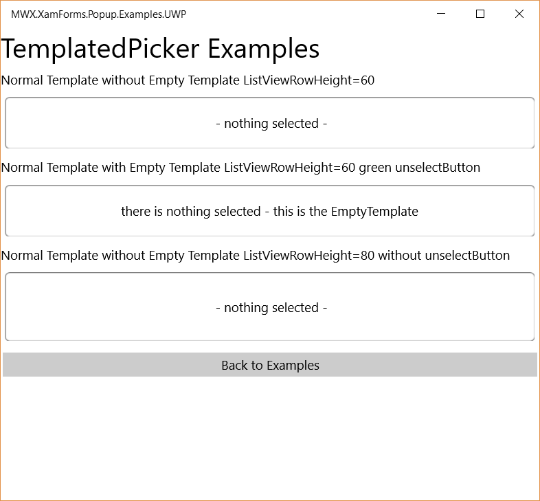
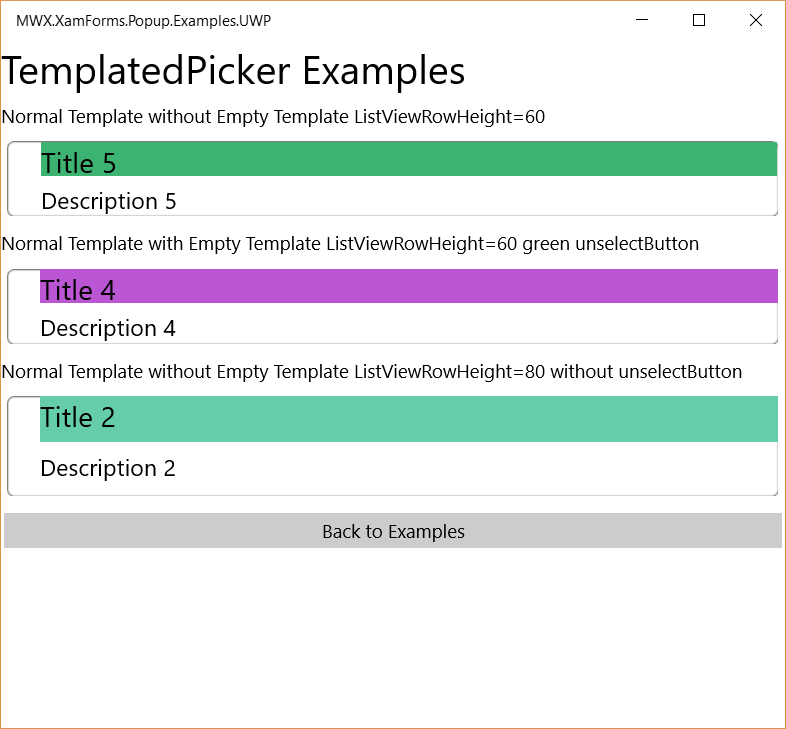
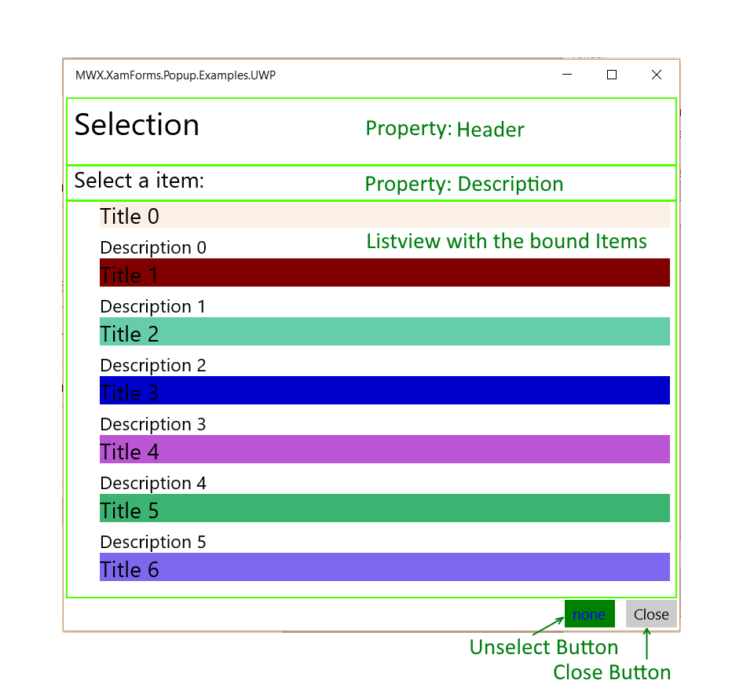

# Xamarin.Forms Popup View

This repository houses an example of using the Xamarin.Forms API to create a popup view.

It's inspired and based on the FormsPopUp implementation of Michael Davis - https://github.com/michaeled/FormsPopup

But i fixed some issues and extended it with an TemplatedPicker, which is correctly bindable and doesnt use any platformspecific components.


Build State: 

**NuGet** 

Released: [](https://www.nuget.org/packages/MWX.XamForms.Popup/)
Pre-Release: [](https://www.nuget.org/packages/MWX.XamForms.Popup/)

The Control Library is available as NuGet Package MWX.XamForms.Popup here https://www.nuget.org/packages/MWX.XamForms.Popup/

It's currently in prerelease state but will get released soon!

**Projects**

* MWX.XamForms.Popup                   - (The `Popup` implementation)
* MWX.XamForms.Popup.Examples          - the Xamarin Forms Sample Implementation
* MWX.XamForms.Popup.Examples.Droid    - the Andorid Host Projekt for the Example
* MWX.XamForms.Popup.Examples.iOS      - the iOS Host Projekt for the Example

## A short note ##

This project has a few documented issues. They are mostly related to iOS9.
I cannot test everything in iOS because i don't have the test-devices.

## Initializing

The current implementation requires either one of two conditions be met before you can use a popup view within a `Page`:

1. The visible page must extend from the `PopupPage` class.
2. Any visible page that does not extend from `PopupPage` must instantiate an object of type `PopupPageInitializer` after the page's content has been set. This is easier than it seems:

**Examples**

There is a sample project in the solution where you can test it.

## Xaml Usage

At first you need to import the namespace as a xmlns for the use in your Xaml.
```xaml
<ContentPage ...
             xmlns:pop="clr-namespace:MWX.XamForms.Popup;assembly=MWX.XamForms.Popup"
             ...
             >
```

## TemplatedPicker

The templated Picker is a full featured Picker, where you can use Templates for the Items in Selected View and the Popup ListBox.

some Screenshots of the Picker in the SampleApp:

- Examples-Page without Selection


- Examples-Page with Selection


Here is a overview how the Picker is composed:



### Properties of the TemplatedPicker
Here some of the Key Properties to Control:

#### Template-Properties:

| Property  | Description |
| ------------- | ------------- |
| CellTemplate | defines the Style of one Item in the SelectedView and in the ListBox. |
| EmptyTemplate | defines what should be displayed when nothing is selected. |

#### Data-Properties:

| Property  | Description |
| ------------- | ------------- |
| SelectedItem | returns or sets the currently selected Item |
| ItemsSource | List of the selectable Items |

#### Styling-Properties

| Property  | Description |
| ------------- | ------------- |
| PopUpWidthRequest | Relative Width of the PopUp ( between 0 .. 1 ) relative to the Page |
| PopUpHeightRequest | Relative Height of the PopUp ( between 0 .. 1 ) relative to the Page |
| HeaderBackgroundColor | BackgroundColor of the Header Part with the Title |
|  |  |
| HeaderText | Header Text |
| HeaderTextColor | Color of the Close Header-Text |
| HeaderPadding | Padding of the Header-Text
| HeaderFontSize | Font Size of the Header-Text
|  |  |
| DescriptionText | Text shown in the description
| DescriptionFontSize | Font Size of the description
|  |  |
| BodyPadding | Padding of the Body Content
| BodyBackgroundColor | Background Color of the Body-Part with the 
|  |  |
| ListViewRowHeight | Height of one Item
|  |  |
| FooterBackgroundColor | Background color of the Footer-Part
|  |  |
| UnSelectButtonVisible | true if the UnSelectButton (for no selection) should be visible
| UnSelectButtonText | Text of the Unselect-Button
| UnSelectButtonTextColor | TextColor of the Unselect-Button
| UnSelectButtonBackgroundColor | Background Color of the Unselect-Button
|  |  |
| CloseButtonText | Text of the Close Button
| CloseButtonTextColor | Color of the Close Button-Text
|  |  |
| SelectedOutlineColor | Outline Color of the selected Item (when the Picker is closed)
| SelectedBackgroundColor | Background Color of the selected Item 
|  |  |
| EmptyText | Text that should be displayed when no item is selected and no EmptyTemplate is provided.


### MVVM
You can fully bind it your ViewModel:
```xaml
            <pop:TemplatedPicker ItemsSource="{Binding Items}" SelectedItem="{Binding SelectedItem}" ListViewRowHeight="60">
                <pop:TemplatedPicker.CellTemplate>
                    <DataTemplate>
                        <ViewCell>
							... add your Template here ...
                        </ViewCell>
                    </DataTemplate>   
                </pop:TemplatedPicker.CellTemplate>
				<!-- optionally you can also configure an empty template that is shown when no item is selected. -->
                <pop:TemplatedPicker.EmptyTemplate>
                    <DataTemplate>
                        <ViewCell>
							... add your Empty-Template here ...
                        </ViewCell>
                    </DataTemplate>
                </pop:TemplatedPicker.EmptyTemplate>
            </pop:TemplatedPicker>
```

#### Open Popup via XAML

See the ComplexLayoutExample - you can simply bind it to the **ShowHideCommand** of the popup.

```xaml
    <Button Text="Show/Hide Bound" Command="{Binding ShowHideCommand, Source={x:Reference popup1} }" />
...
    <ex:Popup x:Name="popup1" ... />
```

optionally you can provide a command-parameter that indicates if it should be opened or closed - if no parameter is provided it's toggled.

### Open PopUp from ViewModel

Also shown in the ComplexLayoutExample - The ViewModel can provide a Property of the type ***Action\<bool\>***, which is bound to the Property ***ShowHideFunction***.
Then this Delegate is set from the Control, which enables the ViewModel - or whatever is bound to it - to Show or Hide the PopUp.

A sample for the property in the ViewModel:
```csharp
    public Action<bool> ShowHidePopUp { get; set; }
```

And the Binding in the Xaml:
```xaml
    ShowHideFunction="{Binding ShowHidePopUp}"
```


## Dynamic Content

If you want to use the Picker or a PopUp in a ListView or other dynamic Controls, you need to embed it into a PopupPage or use a PopUpInitializer directly on the Page to initialize the PopUp.

```xaml
            <pop:PopUpInitializer />

            <ListView ItemsSource="{Binding SelectableItemsArray}" >
                <ListView.ItemTemplate>
                    <DataTemplate>
                        <ViewCell>
                            <pop:TemplatedPicker ItemsSource="{Binding Items, Source={x:Reference viewModel}}" SelectedItem="{Binding Item}" ListViewRowHeight="60">
                                <pop:TemplatedPicker.CellTemplate>
                                    <DataTemplate>
                                        <ViewCell>
                                            <Grid>
                                                <Grid.RowDefinitions>
                                                    <RowDefinition />
                                                    <RowDefinition />
                                                </Grid.RowDefinitions>
                                                <Grid.ColumnDefinitions>
                                                    <ColumnDefinition Width="20"/>
                                                    <ColumnDefinition/>
                                                </Grid.ColumnDefinitions>
                                                <Label Grid.Row="0" Grid.Column="1" Text="{Binding Title}" FontSize="Medium" BackgroundColor="{Binding BackColor}" />
                                                <Label Grid.Row="1" Grid.Column="1" Text="{Binding Description}" FontSize="Small" />
                                            </Grid>
                                        </ViewCell>
                                    </DataTemplate>
                                </pop:TemplatedPicker.CellTemplate>
                        </ViewCell>
                    </DataTemplate>
                </ListView.ItemTemplate>
            </ListView>
```

## Normal PopUp's

You can also use the normal PopUps.

The normal PopUps need CodeBehind in the Page so fully MVVM supported.

Here is a Sample:

```csharp
public class CodedSimpleExample : ContentPage
{
	public CodedSimpleExample()
	{
		var popup = new Popup
		{
			XPositionRequest = 0.5,
			YPositionRequest = 0.2,
			ContentHeightRequest = 0.1,
			ContentWidthRequest = 0.4,
			Padding = 10,
	
			Body = new ContentView
			{
				BackgroundColor = Color.White,
				Content = new Label
				{
					XAlign = TextAlignment.Center,
					YAlign = TextAlignment.Center,
					TextColor = Color.Black,
					Text = "Hello, World!"
				}
			}
		};

		var button = new Button {Text = "Show Popup"};
		button.Clicked += (s, e) => popup.Show();
		
		Content = new StackLayout
		{
			Children = 
			{
				button
			}
		};
		
		// Required for the popup to work. It must come after the Content has been set.
		new PopupPageInitializer(this) {popup};
	}
}
```

Two examples have been added to the `MWX.XamForms.Popup.Examples` project to demonstrate this point. Reference either `CodedPopupExample.cs` or `XamlPopupExample.xaml/XamlPopupExample.cs`.

## Sizing and Placement

The current implementation relies heavily on proportional sizes. For any `Popup` properties that require a location or size, you should pass in a value between 0 and 1.

**Example**

```csharp
var popup = new Popup
{
	XPositionRequest = 0.5,
	YPositionRequest = 0.5,
	ContentWidthRequest = 0.8,
	ContentHeightRequest = 0.8
};
```

## Events

The following events are invoked during various moments in a popup's life cycle. They're availble to all `Popup` views.

* Initializing (happens once, during the hosting page's `Appearing` event)
* Tapped
* Showing
* Shown
* Hiding
* Hidden

The `Tapped`, `Showing`, and `Hiding` events can be cancelled by using the event argument property:

**Example**

```csharp
private void Popup1_Showing(object sender, PopupShowingEventArgs e)
{
	if (_preventShowing.On)
	{
		e.Cancel = true;
	}
}
```

## Animations

The `Popup.ShowAsync()` and `Popup.HideAsync()` methods can be used to add animations. If you do not wish to include animations, you can use either `Popup.Show()` or `Popup.Hide()`.

**Example**

```csharp
double original;

await popup.ShowAsync(async p =>
{
	original = p.Scale;

	await Task.WhenAll
	(
		/** 
		 *  Since p is the Popup object, scaling it would also affect the overlay
		 *  behind the popup's body. Although it wouldn't be noticeable in this simple example,
		 *  it would be if the overlay's color was set.
		**/
		
		p.SectionContainer.RelScaleTo(0.05, 100, Easing.CubicOut),
		p.SectionContainer.RelScaleTo(-0.05, 105, Easing.CubicOut)
	).ContinueWith(c =>
	{	// reset popup to original size
		p.SectionContainer.Scale = original;
	});
});
```

## Styling

At this moment, there are no default styles for the popup. Your views will inherit whatever styles you have attached to your resource dictionaries.

## Miscellaneous Features

* The left, top, right, and bottom border colors can be individually set
* During the `Tapped` event, you can determine if the user tapped within the header, body, or footer sections.

## Screenshots


More screenshots are available in the repository.

## Who am i?

My name is Stefan M. Marek and i develop Software for the Austian Post and for myself ;).

| please also visit my personal page: |
| :--: |
| [<br/>Marekworks.at](https://marekworks.at) |

## FAQ

<dl>
  <dt>Q. Can I use XAML to create popup views?</dt>
  <dd><strong>A.</strong> Of course!</dd>

  <dt>Q. Can I add control XX in the popup?</dt>
  <dd><strong>A.</strong> I don't see why not. Let me know if you have any problems.</dd>
</dl>
